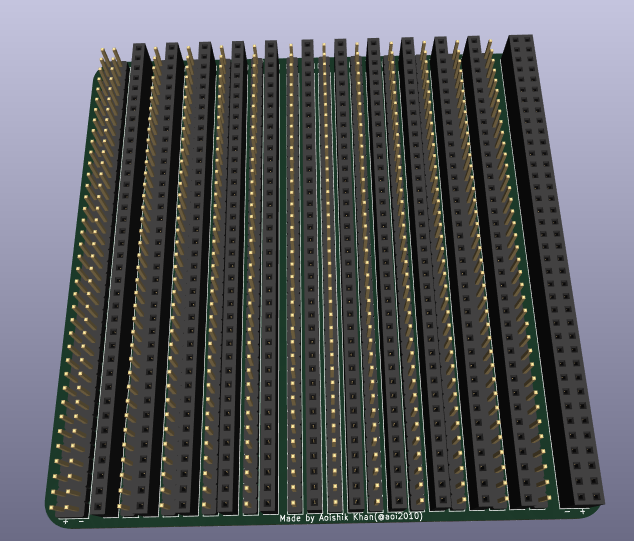
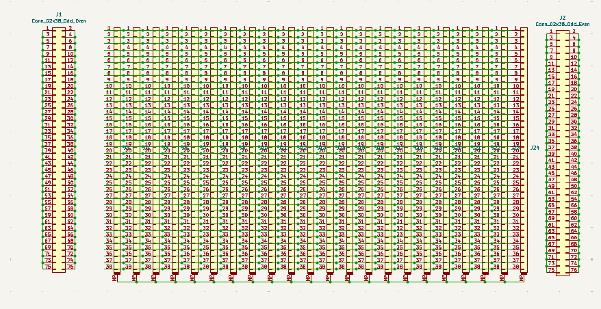
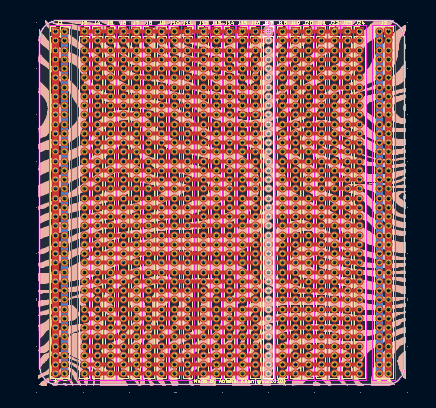
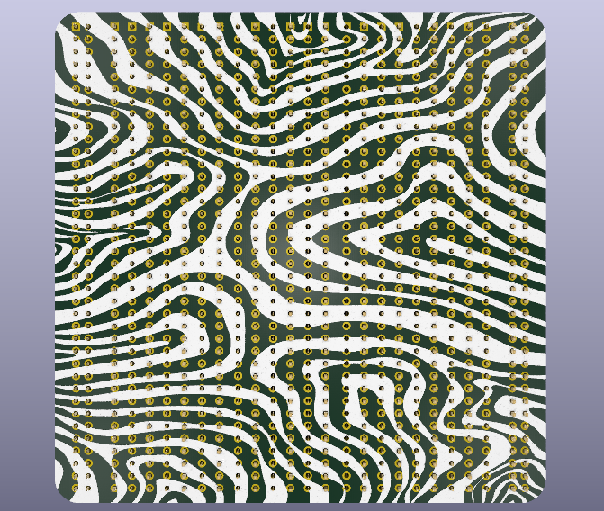
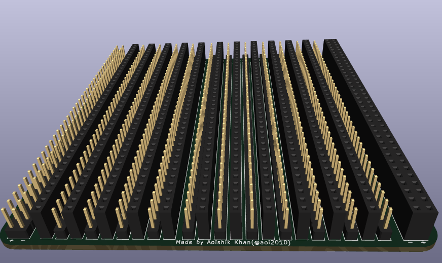

# Equality Breadboard
A breadboard with both male and female header pins.

### Inspiration

I searched in google about Male Breadboards but no results came up. I thought why only breadboards with female header pins are available in the market. So I decided to make a breadboard with both male and female header pins. And, here we are! A breadboard with both male and female header pins. I hope this project will be useful for everyone who wants to use a breadboard with both male and female header pins. lol

### Challenges

Finding 1x40 header pins was a challenge as they are mostly out of stock in India.

### How To Use This
- STEP 1: Buy all the things listed in the BOM, and order the PCB.
- STEP 2: Solder the header pins to the PCB.
- STEP 3: Voila! You have your breadboard ready!
- STEP 4: Do Anything With It and have fun!
Thank You! Also Please give a star to this poor fellow if you like the project. Thank You Again!

### Specifications

BOM (from `BOM.csv`):

| Name | Qty | Purpose | Total Cost (USD) | Link | Distributor |
|---|---:|---|---:|---|---|
| 2.54mm 40x1 Male Blue Straight Burg Strips (Pack of 5) | 7 | BREADBOARD PINS | $1.70 | [Buy](https://roboticsdna.in/product/2-54mm-40x1-male-blue-straight-burg-strips-pack-of-5/) | Robotics DNA |
| 40x2 Pin 2.54mm Pitch Male Berg Strip | 3 | BREADBOARD PINS | $0.40 | [Buy](https://robocraze.com/products/40x2-pin-2-54mm-pitch-male-berg-strip?variant=43046631801056) | Robocraze |
| 40x2 Female Berg Strip | 1 | BREADBOARD PINS | $0.20 | [Buy](https://robocraze.com/products/40x2-female-berg-strip?variant=40192365887641) | Robocraze |
| 40x1 Female Berg Strip | 11 | BREADBOARD PINS | $1.10 | [Buy](https://robocraze.com/products/40x1-female-berg-strip?variant=40192367689881) | Robocraze |
| PCB | 5 | PCB | $12.46 | N/A | JLCPCB |
| TAX | 1 | TAX | $1.00 | N/A | Indian Govt. |
| SHIPPING | 2 | SHIPPING | $1.33 | N/A | Robocraze & Robotics DNA |

Others:
- PCB Gerber Files

Schematic | PCB Layout |
:-------------------------:|:-------------------------:|
 |  |

PCB Top | PCB Back | PCB Side |
:-------------------------:|:-------------------------:|:-------------------------:|
 |  |  |

### Notes
You can also switch the whole breadboard to male header pins if you want. Just solder the male header pins to the PCB instead of the female header pins. But, I have designed the PCB in such a way that you can easily switch between male and female header pins.

Thank You for Understanding.

## Thanks For Reading! Also leave a star if you like the project! ⭐

